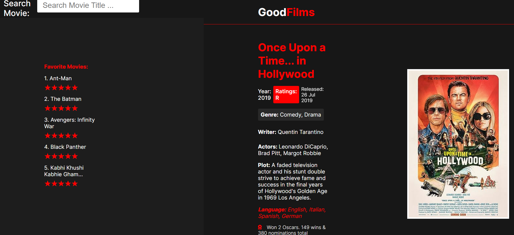

# GoodFilms Movie Database

## Description
This project is a database that allows users to search for movies using keywords.
It utilizes a front end that is interactive and event-driven, and a back end that serves resources with a RESTful CRUD API.
The project integrates with a third-party API, the OMDb API, to fetch movie data and utilizes session-persistent state for user-specific preferences and data.
The user experience is designed to be simple, with easy navigation and user-friendly interface.

## Features

- Interactive and event-driven front end
- RESTful CRUD API for managing movie resources
- Integration with a third-party API for fetching movie data
- Session-persistent state for user-specific preferences and data
- Pleasing user experience with intuitive design and easy navigation

## Technologies Used

- HTML5
- CSS3
- JavaScript
- Node.js
- Express.js
- Axios (for making HTTP requests)
- OMDb API (Third-party API for fetching movie data)

## Link to Presentation Video
[GoodFilms Movie Database](https://drive.google.com/file/d/1ljQvCdLLyjjOGCSbtOzJjucpCGfnFJxa/view?usp=sharing)

## Contributors
Justin Li (730610101)

Matthew Vandeusen (730527491)

Anjali Yellapuntula Venketa (730716582)

Aftab Khan (730644047)

